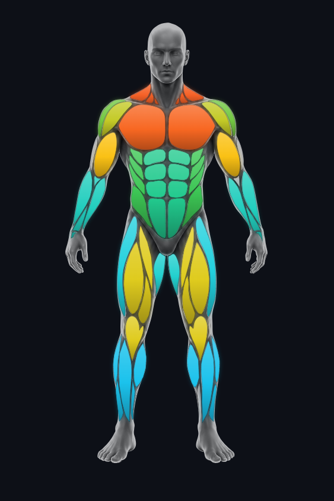
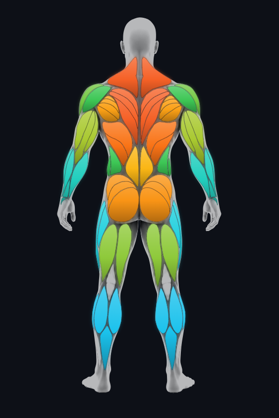
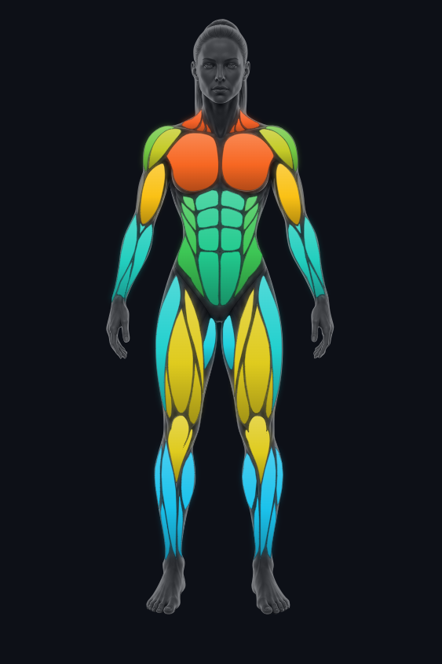
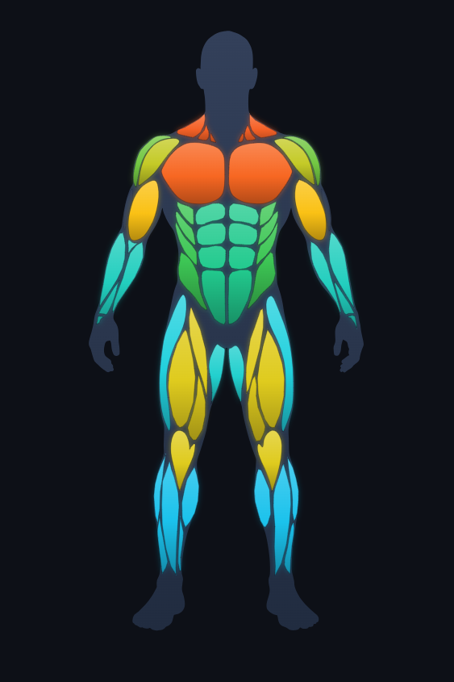
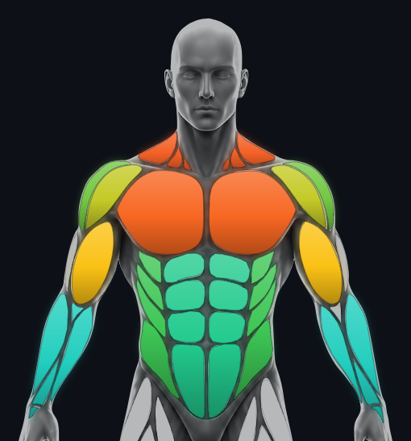
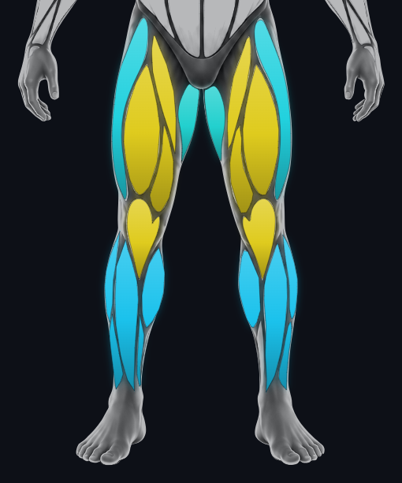

<div align="center">

# MuscleMap

**Premium, data-driven muscle heatmaps for the web.**
Render the human body and color each muscle group by a 0–100 score — as a clean flat-vector figure **or** layered over a photorealistic body. Headless core + React.

[](https://github.com/Jsplice/MuscleMap/actions/workflows/ci.yml)
[](#what-it-is)
[](LICENSE)





</div>

---

## What it is

MuscleMap is a **standalone visualization library** for showing human bodies and muscle groups as an interactive heatmap. You feed it normalized scores per muscle (0–100); it paints the body.

It is intentionally **app-agnostic** — no database, no backend, no auth, no framework lock-in in the core. It was built for fitness analytics products (e.g. TrainPilot / RepMap) but ships free of any of them.

> **Not** an analytics or tracking tool — purely the rendering layer. Your app calculates the scores; MuscleMap draws them.

> **Status — `0.1.0`, early / pre-release.** Included: the core API, color engine, region rules, **male & female front/back bodies**, the React component, unit tests and CI. The public API may still change before `1.0`.

### Highlights

- 🧠 **Headless core** — color scales, region/visibility rules and scoring helpers with zero UI, usable from any framework.
- 🖼️ **Two looks, one component** — flat vector silhouette, or a greyscale photoreal body with the colored muscles laid on top, pixel-aligned.
- 🎯 **Each muscle surface individually addressable** — color a whole group (bundled) *or* a single surface like `TRAPEZIUS_LEFT` (e.g. left/right balance).
- 🔍 **Region views** — full body, upper body, lower body — actually cropped, not just zoomed.
- 🎨 **Multiple color models** — Load, Frequency, Balance, Recovery Risk — body fills and legend always in sync.
- 💎 **Premium dark aesthetic** — per-muscle gradient shading, soft glow, hover/tap tooltips.
- ✏️ **Bring your own body** — trace any anatomy in Inkscape and drop it in (see [Assets](#assets--bring-your-own-body)).

---

## Screenshots

| Flat vector | Photoreal hybrid | Upper-body view | Lower-body view |
|---|---|---|---|
|  |  |  |  |

---

## Architecture

```txt
Host app training data
  → host app aggregation / API
  → normalized MuscleMap scores  (0–100 per muscle)
  → @musclemap/core    headless types, color scales, visibility rules
  → @musclemap/assets  body diagrams (SVG path data + region boxes)
  → @musclemap/react   <MuscleMap /> component
  → SVG heatmap
```

| Package | Responsibility |
|---|---|
| **`@musclemap/core`** | Domain types (`MuscleGroup`, `MuscleMapValues`, …), color scales (`getMuscleHeatColor`, `getColorScaleCss`), region/visibility rules (`getVisibleMuscleGroups`). UI-free. |
| **`@musclemap/assets`** | Per-sex, per-view `BodyDiagram`s: muscle path data with semantic IDs + cropped region viewBoxes. Framework-free. |
| **`@musclemap/react`** | The `<MuscleMap />` and `<MuscleMapLegend />` components. |
| **`apps/playground`** | Vite demo for visual QA (not published). |

---

## Install

```bash
pnpm add @musclemap/react @musclemap/core @musclemap/assets react react-dom
```

## Quick start

Feed `values` keyed by [`MuscleGroup`](packages/core/src/types.ts), each with a `score` from 0–100. That's the whole contract.

```tsx
import { MuscleMap } from "@musclemap/react";
import type { MuscleMapValues } from "@musclemap/core";

const values: MuscleMapValues = {
  CHEST:      { score: 88, volumeKg: 7200, sets: 24, trend: "UP" },
  TRAPEZIUS:  { score: 90 },
  LATS:       { score: 84 },
  QUADS:      { score: 66 },
  CALVES:     { score: 26, trend: "DOWN" },
  // …any subset of muscle groups
};

export function Analytics() {
  return (
    <MuscleMap
      values={values}
      view="BOTH"          // FRONT | BACK | BOTH
      colorModel="LOAD"    // LOAD | FREQUENCY | BALANCE | RECOVERY_RISK
    />
  );
}
```

Your app owns aggregation; MuscleMap just renders. `volumeKg` / `sets` / `trend` are optional and only used by the tooltip.

### Per-surface (left/right) addressing

Color a whole group via `values`, or override an individual surface via `partValues` (keyed by the path's `id`, e.g. `HAMSTRINGS_LEFT`). Perfect for left/right balance.

```tsx
<MuscleMap
  values={{ HAMSTRINGS: { score: 70 } }}        // both sides, bundled
  partValues={{
    HAMSTRINGS_LEFT:  { score: 90 },            // overrides just the left
    HAMSTRINGS_RIGHT: { score: 50 },
  }}
/>
```

The selection callback reports the surface too, so you can react to a specific left/right click — `partId` is `undefined` when a bundled (whole-group) path is tapped:

```tsx
<MuscleMap
  values={{ HAMSTRINGS: { score: 70 } }}
  partValues={{
    HAMSTRINGS_LEFT:  { score: 90 },
    HAMSTRINGS_RIGHT: { score: 50 },
  }}
  onSelectMuscle={({ group, partId, value }) => {
    console.log(group, partId, value?.score); // "HAMSTRINGS" "HAMSTRINGS_LEFT" 90
  }}
/>
```

### Photoreal hybrid

Pass a body photo as the background; it's clipped to the silhouette and (optionally) desaturated, with the colored muscles on top — pixel-aligned because both come from the same trace.

Four ready-to-use body photos ship with **`@musclemap/assets`** (import them as asset URLs), or pass any URL of your own:

```tsx
import maleFront from "@musclemap/assets/bodies/male-front.webp";
import maleBack  from "@musclemap/assets/bodies/male-back.webp";

<MuscleMap
  values={values}
  backgroundImageFront={maleFront}
  backgroundImageBack={maleBack}
  backgroundGrayscale          // strip the photo's colors → neutral grey body
  backgroundBrightness={1.2}
  backgroundOpacity={0.45}
/>
```

> The bundled photos are AI-generated demo bodies (MIT). For production/marketing, swap in your own branded imagery — `backgroundImage*` takes any URL.

---

## Views (full / upper / lower body)

Set `region` and turn on `cropToRegion` to get a **real cropped view**, not just a zoom — the figure only occupies the space of its region and out-of-region muscles are inactive.

```tsx
// Full body
<MuscleMap values={values} view="FRONT" region="FULL_BODY" />

// Upper body — only chest/back/shoulders/arms/abs active, cropped to the torso
<MuscleMap values={values} view="FRONT" region="UPPER_BODY" cropToRegion />

// Lower body — only legs active, cropped to hips→feet
<MuscleMap values={values} view="FRONT" region="LOWER_BODY" cropToRegion />
```

| Region | Active muscles | Frame |
|---|---|---|
| `FULL_BODY` | everything | head → feet |
| `UPPER_BODY` | chest, back (traps/lats/rhomboids), shoulders, arms, abs, obliques, lower back | head → waist |
| `LOWER_BODY` | glutes, quads, hamstrings, calves, adductors, abductors, hip flexors | hips → feet |

There's also a `CORE` region (abs, obliques, lower back) for isolating the midsection — abs belong to both `UPPER_BODY` and `CORE`. The playground demos the three main views; the API supports all four regions.

> Region viewBoxes are precomputed per body and stored on the `BodyDiagram`, so cropping is exact for whatever geometry you ship.

---

## Color models

`getMuscleHeatColor(score, model)` (continuous) drives the body; `getColorScaleCss(model)` drives the legend, so they never drift apart.

| Model | Scale |
|---|---|
| `LOAD` | training load — blue → cyan → green → yellow → orange → red |
| `FREQUENCY` | how often trained |
| `BALANCE` | under-represented (violet) → balanced (green) → over (red) |
| `RECOVERY_RISK` | ready (green) → risky (red) |

```ts
import { getMuscleHeatColor, getColorScaleCss } from "@musclemap/core";

getMuscleHeatColor(72, "LOAD");        // "#f9a..." smooth interpolation
getColorScaleCss("LOAD", "90deg");     // "linear-gradient(90deg, …)"
```

### Single-color (monochrome) scale

Prefer one brand color over the multi-hue ramps? Set `monochromeColor` — the body and legend then run a single grey → color scale (0–100). `colorModel` is ignored while it's set.

```tsx
// 0 = grey → 100 = your blue
<MuscleMap values={values} monochromeColor="#2f7bff" />

// optional: override the score-0 base color
<MuscleMap values={values} monochromeColor="#2f7bff" monochromeBaseColor="#e5e7eb" />
```

```ts
import { getMonochromeColor, getMonochromeScaleCss } from "@musclemap/core";

getMonochromeColor(0, "#2f7bff");      // "#6b7280" (grey base)
getMonochromeColor(100, "#2f7bff");    // "#2f7bff" (full color)
getMonochromeColor(50, "#2f7bff");     // halfway blend
getMonochromeScaleCss("#2f7bff");      // "linear-gradient(90deg, #6b7280 0%, #2f7bff 100%)"
```

---

## `<MuscleMap />` props

| Prop | Type | Default | Description |
|---|---|---|---|
| `values` | `MuscleMapValues` | — | Score per muscle group (0–100). |
| `partValues` | `Partial<Record<string, MuscleMapValue>>` | — | Per-surface overrides keyed by path id. |
| `sex` | `"MALE" \| "FEMALE"` | `"MALE"` | Which body — male and female front/back are both included. |
| `view` | `"FRONT" \| "BACK" \| "BOTH"` | `"BOTH"` | Which side(s). |
| `region` | `"FULL_BODY" \| "UPPER_BODY" \| "LOWER_BODY" \| "CORE"` | `"FULL_BODY"` | Active region. |
| `cropToRegion` | `boolean` | `false` | Crop the figure to `region`. |
| `colorModel` | `"LOAD" \| "FREQUENCY" \| "BALANCE" \| "RECOVERY_RISK"` | `"LOAD"` | Heatmap scale. |
| `monochromeColor` | `string` | — | Single-color override: tints the body/legend with a grey→color scale (0–100). Overrides `colorModel`. |
| `monochromeBaseColor` | `string` | `"#6b7280"` | Base color at score 0 for the monochrome scale. |
| `glow` | `boolean` | `true` | Glow halo behind active muscles. |
| `showLegend` | `boolean` | `true` | Render the gradient legend. |
| `tooltipFields` | `TooltipField[]` | `["group","score"]` | What the hover/tap tooltip shows. |
| `labels` | `Partial<Record<MuscleGroup,string>>` | — | Localized tooltip labels (defaults to the raw enum). |
| `backgroundImageFront` / `backgroundImageBack` | `string` | — | Body photo behind the figure. |
| `backgroundGrayscale` / `backgroundBrightness` / `backgroundOpacity` | `boolean` / `number` / `number` | `false` / `1` / `1` | Background image treatment. |
| `figureWidth` | `number` | `200` | Per-figure SVG width (px). |
| `onSelectMuscle` | `(selection: { group: MuscleGroup; partId?: string; value?: MuscleMapValue }) => void` | — | Fired on tap/click with the selected muscle `group`, the optional surface `partId` (e.g. `HAMSTRINGS_LEFT`), and the resolved `value` (respecting `partValues`). |

---

## Assets — bring your own body

A `BodyDiagram` is just SVG path data with semantic IDs. To add or replace a body:

1. **Trace** the muscles in [Inkscape](https://inkscape.org) over a reference image (front + back). Use the pen tool (BSpline mode for smooth curves).
2. **Name** each path in the Objects panel with a semantic label — `CHEST_LEFT`, `QUADS_LEFT`, `TRAPEZIUS_LEFT`, … plus a `BODY` silhouette. Inkscape stores these as `inkscape:label`.
3. **Keep one viewBox** for the body and its reference photo so the colored vector and the photo stay aligned.
4. **Import** — flatten the labelled paths to absolute coordinates and emit a `BodyDiagram`. The region viewBoxes are computed automatically from the muscle positions.

Each labelled surface becomes individually addressable; the coarse `group` (mapped from the label) enables region filtering and bundled coloring.

> **Licensing:** **Everything is MIT — free to use, modify and redistribute.** The traced **SVG path data** in `@musclemap/assets` is original work. The four **body photographs** used for the hybrid look were **generated with OpenAI image tooling from the maintainer's own prompts and then manually edited/traced**; they ship in `@musclemap/assets` (`bodies/*.webp`, importable as asset URLs) and are MIT too. They're AI-generated demo bodies — swap in your own for production. Full breakdown: [`ASSET_PROVENANCE.md`](ASSET_PROVENANCE.md).

---

## Development

```bash
pnpm install
pnpm build       # build packages (core → assets → react)
pnpm dev         # run the playground
pnpm typecheck
pnpm lint        # ESLint + SonarJS rules
pnpm test        # vitest
```

### Publishing

The three packages depend on each other via the `workspace:*` protocol. Publish
**with pnpm** (`pnpm -r publish` / `pnpm pack`) — it rewrites those to the
concrete version (e.g. `0.1.0`) in the published tarball; plain `npm publish`
does **not**. Each package sets `publishConfig.access: "public"` so the scoped
packages publish publicly. CI packs the tarballs and fails if any still contains
a `workspace:` dependency.

---

## License

**MIT — and it covers everything in this repository**: all source code, the
traced SVG muscle path data in `@musclemap/assets`, **and** the four body photos
bundled in `@musclemap/assets` (`bodies/*.webp`, generated with OpenAI image
tooling from the maintainer's own prompts, then manually edited). All of it is
free to use, modify and redistribute. See [`LICENSE`](LICENSE) and
[`ASSET_PROVENANCE.md`](ASSET_PROVENANCE.md).
